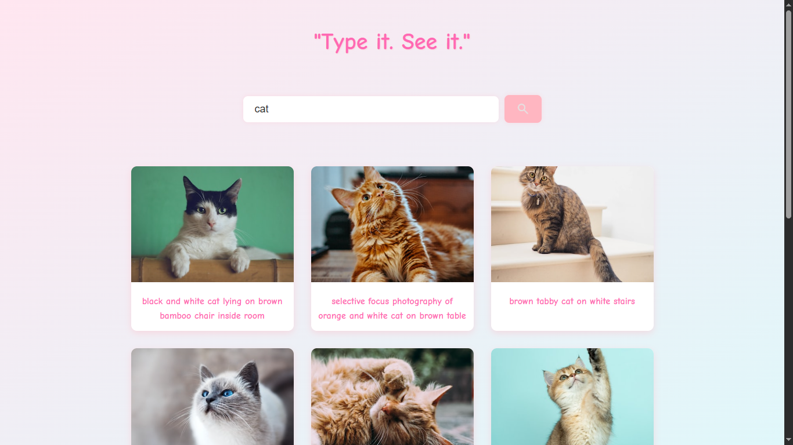

# 🌸 Image Search App

A responsive image search app built with **HTML**, **CSS**, and **vanilla JavaScript**, powered by the [Unsplash API](https://unsplash.com/developers).  
Users can search for beautiful images, view them in a clean grid layout, and load more results with a single click.

> 💡 **Note for users in Iran**: Due to restrictions on accessing Unsplash API, a VPN is required to run this project properly.

---

## ✨ Features

- Search for images by keyword using Unsplash API
- "Show More" button to load additional results
- Responsive layout for desktop and mobile
- Smooth transitions and clean DOM manipulation

---

## 📸 Preview

---

## 🚀 Live Demo

👉 [Click here to view the live project](https://sepinoodl.github.io/image-search/)

---

## 🛠️ Technologies Used

- HTML5
- CSS3 (Flexbox, gradients, media queries)
- JavaScript (ES6)
- Unsplash API
- Google Fonts: Comic Neue

---

## 📁 Folder Structure

├── index.html 
├── style.css 
├── main.js 
├── imageSearchPreview.png

---

## 🌐 API Info

This app uses the public Unsplash API to fetch image data.  
To use it, you need to register on [Unsplash Developers](https://unsplash.com/developers) and get your own `accessKey`.

---

## 📱 Mobile Support

- Fully responsive layout with media queries
- Optimized for small screens and touch interactions
- Adaptive grid layout for image results

---

## 🧠 About Me

This project was designed and developed by **Sepinood Langari**, a front-end developer passionate about pastel aesthetics, clean UI, and intuitive user experiences.  
I love building tools that feel soft, friendly, and functional — and this image search app is one of my favorites!
